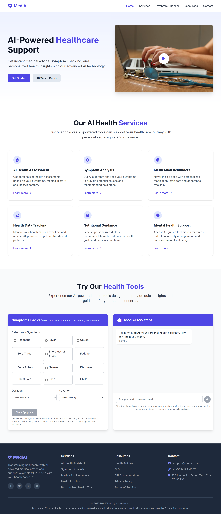
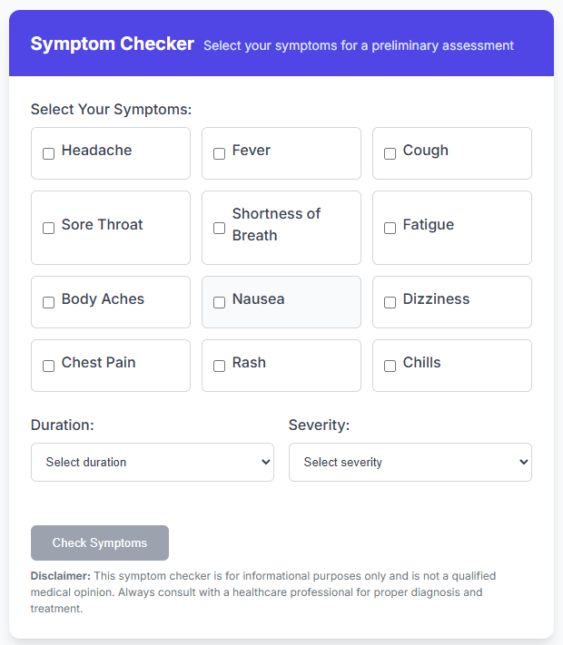
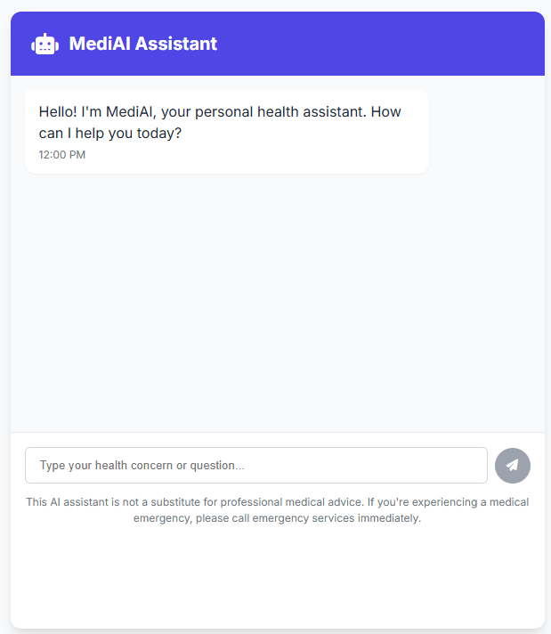

# AI Medical Healthcare Support Web App

A modern, responsive web application that provides AI-powered healthcare support and medical guidance. Built with vanilla HTML, CSS, and JavaScript, this application offers an intuitive interface for users to access medical information and preliminary health assessments.

## Features

- **AI Health Assessment**: Get personalized health insights based on symptoms and medical history
- **Symptom Checker**: Interactive tool for analyzing common symptoms and providing preliminary assessments
- **AI Chatbot**: 24/7 medical information support with intelligent responses to health queries
- **Responsive Design**: Fully responsive layout that works seamlessly across all devices
- **Modern UI/UX**: Clean, professional interface with smooth animations and transitions
- **Video Demo**: Interactive video demonstration of the application's features

## Screenshots

### Desktop View

*Main interface of the AI Medical Healthcare Support web app*

### Symptom Checker

*Interactive symptom analysis tool*

### AI Chatbot Interface

*AI-powered medical support chatbot*

## Tech Used

- HTML5
- CSS3
- JavaScript

## Getting Started

### Installation

1. Clone the repository:
   ```bash
   git clone https://github.com/shihabhasan0161/ai-medical-healthcare-support.git
   ```

2. Navigate to the project directory:
   ```bash
   cd ai-medical-healthcare-support
   ```

3. Open `index.html` in your web browser to view the application.

### Development

To modify or enhance the application:

1. Fork the repository
2. Create a new branch for your feature (`git checkout -b feature/AmazingFeature`)
3. Commit your changes (`git commit -m 'Add some AmazingFeature'`)
4. Push to the branch (`git push origin feature/AmazingFeature`)
5. Open a Pull Request

## Project Structure

```
ai-medical-healthcare-support/
├── index.html          # Main HTML file
├── styles.css          # CSS styles
├── app.js             # JavaScript functionality
└── README.md          # Project documentation
```

## Features in Detail

### Symptom Checker
- Select from common symptoms
- Specify duration and severity
- Receive preliminary health assessment
- Includes medical disclaimers

### AI Chatbot
- Natural language processing for health queries
- Contextual responses to medical questions
- Real-time typing indicators
- Timestamp for each message

### Video Demo
- Modal-based video player
- Responsive video container
- Keyboard accessibility (ESC to close)
- Click-outside-to-close functionality

## License

MIT License

Copyright (c) 2025 Shihab Hasan

Permission is hereby granted, free of charge, to any person obtaining a copy
of this software and associated documentation files (the "Software"), to deal
in the Software without restriction, including without limitation the rights
to use, copy, modify, merge, publish, distribute, sublicense, and/or sell
copies of the Software, and to permit persons to whom the Software is
furnished to do so, subject to the following conditions:

The above copyright notice and this permission notice shall be included in all
copies or substantial portions of the Software.

THE SOFTWARE IS PROVIDED "AS IS", WITHOUT WARRANTY OF ANY KIND, EXPRESS OR
IMPLIED, INCLUDING BUT NOT LIMITED TO THE WARRANTIES OF MERCHANTABILITY,
FITNESS FOR A PARTICULAR PURPOSE AND NONINFRINGEMENT. IN NO EVENT SHALL THE
AUTHORS OR COPYRIGHT HOLDERS BE LIABLE FOR ANY CLAIM, DAMAGES OR OTHER
LIABILITY, WHETHER IN AN ACTION OF CONTRACT, TORT OR OTHERWISE, ARISING FROM,
OUT OF OR IN CONNECTION WITH THE SOFTWARE OR THE USE OR OTHER DEALINGS IN THE
SOFTWARE.

## Acknowledgments

- Font Awesome for icons
- Google Fonts for typography
- Unsplash for medical imagery 